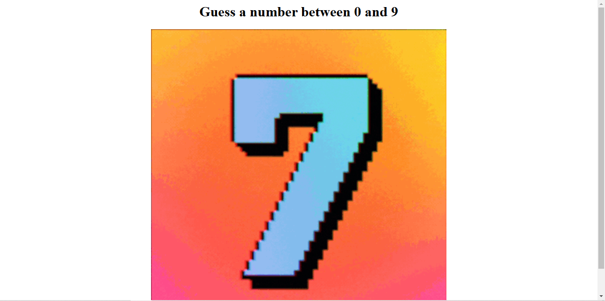
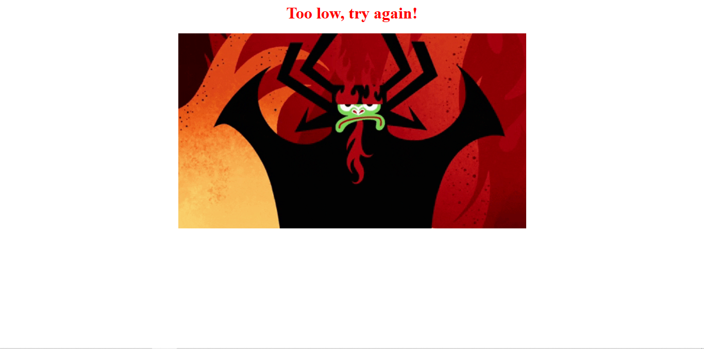
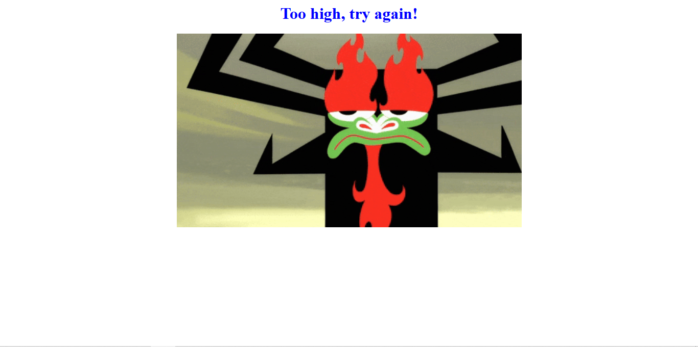
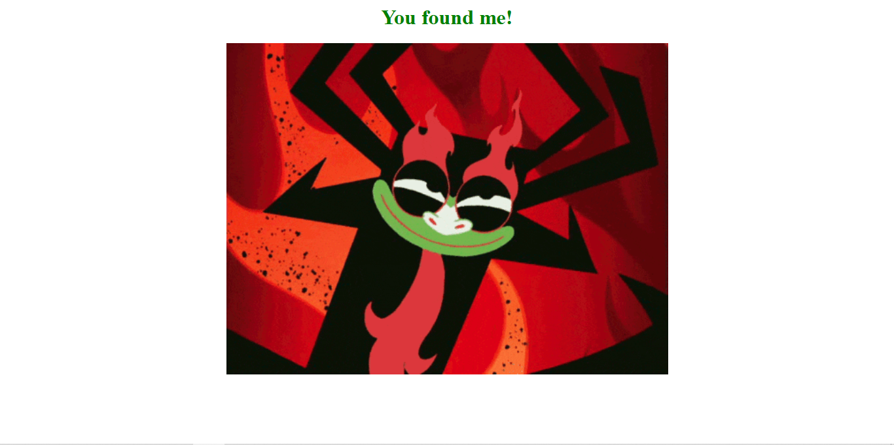
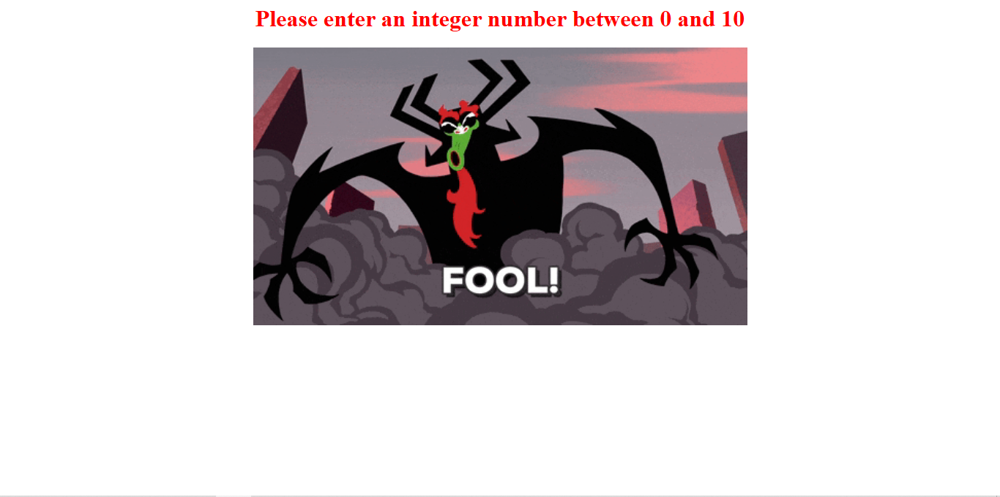

# Flask Higher-Lower Game
A **Flask-based number guessing game** where the server picks a random number between **0 and 10**. Users guess by entering a number in the **URL**, and the app responds with feedback (**too high, too low, or correct**) along with a **GIF**. It includes **error handling** for non-integer inputs.  

## Screenshots
, , , , 

## Author
Pranjal Sarnaik

## Features
- **Flask-powered** number guessing game.  
- **GIF-based feedback** loaded via URLs.  
- **Error handling** for invalid inputs.  
- **Lightweight & easy to run.**  

## Level
Intermediate

## Tech Stack
Flask | Python | Routing | Exception Handling | Web UI | Web Development  

## How to Run
1. Clone the repo:  
   ```bash  
   git clone https://github.com/pranjalco/flask-higher-lower.git

2. Run(Also install required libraries):
    ```bash
   pip install flask
   python server.py
   ```

## **File Structure**
```
flask-higher-lower/
│── app.py         # Main Flask application
│── README.md      # Project documentation
│── screenshots    # Program screenshots
```

**Created by Pranjal Sarnaik**  
*Released under the MIT License*